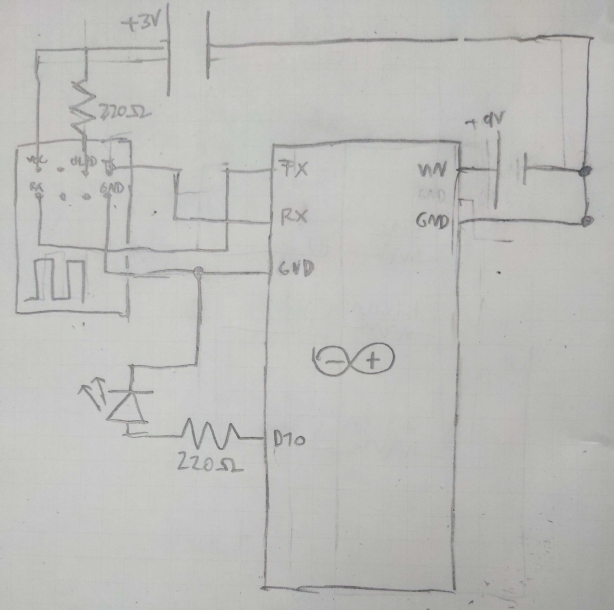

# ESP Blink

Lets you turn an LED on or off with your phone. Utilizes an ESP-01 WiFi module in serial communication with an Arduino Nano.
Power it up, connect to ESP WiFi network(password is `password`), [open its panel](http://192.168.4.1)

The `WifiAccessPoint` and `SerialBlink` sketches are loaded on the [ESP](https://github.com/esp8266/arduino) and Arduino, respectively.

Badly drawn schematic:

Made at the prompting of my engineering teacher as part of a class research project.